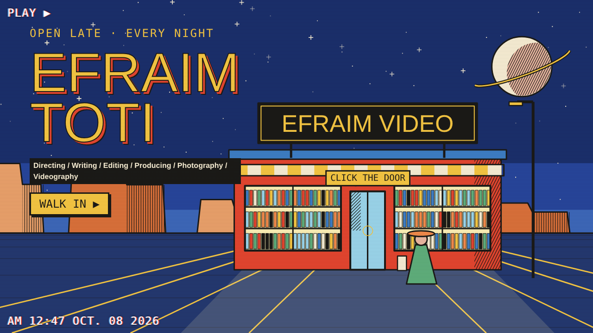
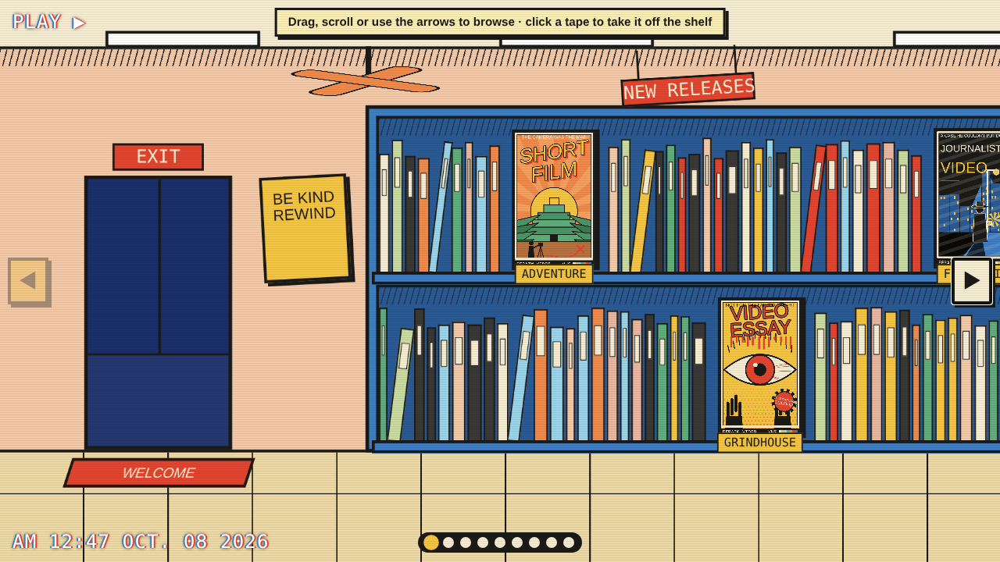
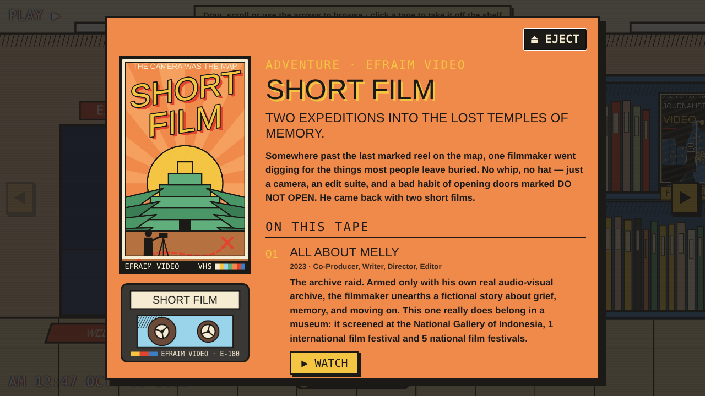
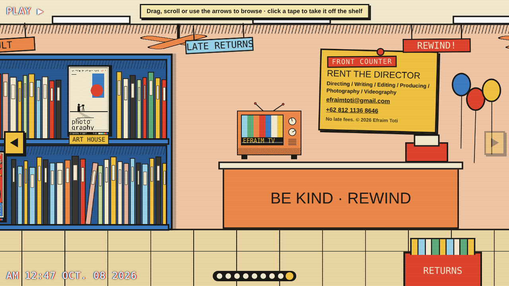

# Efraim Video — Efraim Toti's portfolio

A portfolio dressed as a late-night video rental store. You click the door, walk in, slide along the shelves and pull a tape. Each tape is one section of the portfolio, with a cover painted in the style of a film genre; opening it shows the real projects and links.

It is a plain static site: no build step, no libraries. Every drawing — the storefront, the shelves, the covers, the cassette, the TV — is made by JavaScript in the browser. The only image files are the photographs.

## How it works

**Outside.** A drawn storefront under a night sky. The stars twinkle, the sign flickers, and the door pulses. Click the door (or "Walk in") and the glass doors slide open and the view pushes through the doorway.

**Inside.** One long room you browse sideways by dragging, scrolling, the arrow buttons or the arrow keys. Seven tapes stand face-out among rows of spines. Fans spin, signs sway and a cleaning robot does its rounds.

**Opening a tape.** The cover flies off the shelf and the box opens: the cassette slides out, and the panel lists the projects on that tape with their links. YouTube links show the video's thumbnail; photos show as a grid.

**The counter.** At the far end of the room, with the contact details.

## The tapes

| Tape | Genre it's dressed as | What's on it |
|---|---|---|
| Short Film | Adventure | All About Melly (2023), Hello, Goodbye (2025) |
| Video Essay | Grindhouse | The Rise and Fall of Indonesian Exploitation Film (2026) |
| Journalistic Video | Film noir | Four MyCity episodes (2023) |
| Content Specialist | Sports drama | Lensor Match (2024–2025) |
| Livestream | Sci-fi | Six live broadcasts for ANTV |
| Producing Work | Heist | Lazada Logistic and Citra Indah City commercials |
| Photography | Art house | Photographs |

## Files

- `index.html`, `style.css` — the page shell and all styling and animation
- `data.js` — **all the content**: one entry per tape (title, genre, tagline, blurb, works, links, photos)
- `covers.js` — the cover paintings, one function per genre
- `main.js` — the storefront, the walk-in, the sliding room and the opened-tape view
- `photos/` — the photographs shown on the Photography tape
- `screenshots/` — the pictures in this README

## Editing the content

Everything on the shelves lives in `data.js`.

- **Change a project or link:** edit its entry under the right tape. A YouTube `link` gets a thumbnail automatically; set `thumb` to use a different image.
- **Add photos:** put the files in `photos/` and add a line under `photos` in the Photography tape.
- **Change contact details:** edit `owner` at the top.

## Preview on your computer

Double-click `index.html`. It opens straight from the folder; no server is needed.

## Deploy on GitHub Pages

1. Create a repository and upload every file and folder here to its root (including `.nojekyll`).
2. Repository **Settings → Pages → Build and deployment**: Source = *Deploy from a branch*, Branch = `main`, folder = `/ (root)`.
3. The site appears at `https://<username>.github.io/<repo>/` after a minute or two.

## Accessibility

Every tape, the door and the navigation are real buttons and work from the keyboard. If the visitor's device is set to reduce motion, the animations are switched off and the walk-in becomes a simple cut.
